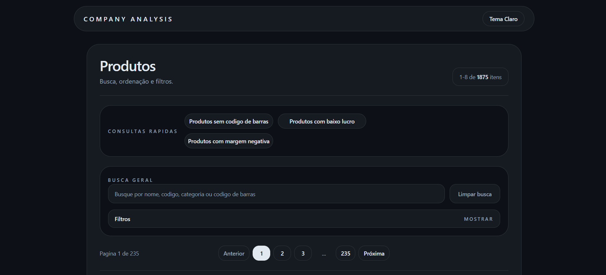

# Company Analysis

Plataforma full stack para consolidação e consulta analítica de produtos, categorias e estoque a partir de arquivos CSV. O repositório está organizado em dois subprojetos principais: um backend em Spring Boot responsável pela ingestão e exposição da API REST e um frontend em React responsável pela experiência de consulta, filtragem e exportação de relatórios.

## Índice

- [Visão geral](#visao-geral)
- [Arquitetura da solução](#arquitetura-da-solucao)
- [Stack e dependências](#stack-e-dependencias)
- [Estrutura do repositório](#estrutura-do-repositorio)
- [Fluxo de dados](#fluxo-de-dados)
- [Principais funcionalidades](#principais-funcionalidades)
- [API disponível](#api-disponivel)
- [Como executar](#como-executar)
- [Configuração](#configuracao)
- [Testes](#testes)
- [Observações importantes](#observacoes-importantes)



<a id="visao-geral"></a>
## Visão geral

O objetivo do projeto é centralizar dados operacionais de produtos em uma interface de consulta orientada a tomada de decisão. A aplicação combina:

- importação automática de arquivos CSV no backend;
- persistência relacional de produtos, categorias e estoque;
- cálculo de custo e margem de lucro por item;
- filtros avançados e consultas rápidas no frontend;
- exportação de relatórios em PDF agrupados por categoria.

Hoje, o sistema atende um cenário em que os dados de catálogo, compras e estoque chegam por arquivos CSV separados, mas precisam ser consumidos como uma visão única na interface.

<a id="arquitetura-da-solucao"></a>
## Arquitetura da solução

### Backend

O backend segue uma separação clássica por camadas:

- `controller`: expõe os endpoints REST para produtos, estoque e categorias;
- `service`: concentra regras de busca, upsert, lookup e exportação;
- `repository`: encapsula o acesso ao banco via Spring Data JPA;
- `domain`: modela entidades como `Product`, `Category` e `Inventory`;
- `dataImport`: organiza o pipeline de ingestão, descoberta de arquivos, resolução de contexto e processadores por módulo;
- `config`: mantém configurações transversais, como CORS.

O pipeline de importação também respeita responsabilidades bem definidas. O `ImportRunner` dispara a carga no startup, o `FileDiscoveryService` localiza arquivos CSV, o `ImportContextResolver` determina o módulo e o `ImportProcessorResolver` delega o processamento ao componente correto.

### Frontend

O frontend está organizado para separar renderização, composição de página e consumo da API:

- `src/pages`: entrada das páginas da aplicação;
- `src/components/layout`: composição da tela principal e navegação;
- `src/components/common`: componentes reutilizáveis de formulário e paginação;
- `src/api`: cliente HTTP, contratos, módulos e serialização das chamadas;
- `src/assets`: recursos visuais estáticos.

Na prática, a tela principal consulta produtos, categorias e estoque em paralelo, enriquece os cards com a quantidade disponível e aplica parte das consultas utilitárias no cliente quando o recorte exige processamento local.

<a id="stack-e-dependencias"></a>
## Stack e dependências

| Camada | Tecnologias principais |
| --- | --- |
| Backend | Java 17, Spring Boot 4.0.4, Spring Web MVC, Spring Data JPA, PostgreSQL |
| Testes do backend | JUnit 5, Spring Boot Test, H2 |
| Frontend | React 19, TypeScript 5, Vite 8, Tailwind CSS 4 |
| Qualidade | ESLint |
| Build | Maven, npm |

<a id="estrutura-do-repositorio"></a>
## Estrutura do repositório

```text
company_analysis_root/
|-- backend/
|   |-- src/
|   |   |-- main/java/com/postoBackend/backend/
|   |   |   |-- config/
|   |   |   |-- controller/
|   |   |   |-- dataImport/
|   |   |   |-- domain/
|   |   |   |-- repository/
|   |   |   `-- service/
|   |   |-- main/resources/
|   |   `-- test/
|   |-- pom.xml
|-- frontend/
|   |-- public/
|   |-- src/
|   |   |-- api/
|   |   |-- assets/
|   |   |-- components/
|   |   `-- pages/
|   `-- package.json
|-- screenshot/
|   `-- screenshot.png
|-- AGENTS.md
`-- README.md
```

<a id="fluxo-de-dados"></a>
## Fluxo de dados

1. O backend inicia e executa automaticamente a importação a partir de `backend/data/`.
2. O processo encontra todos os arquivos `.csv` de forma recursiva.
3. Cada arquivo é associado a um módulo com base no diretório onde está localizado.
4. Os processadores são executados em ordem:
   - `products` primeiro;
   - `purchasing` em seguida;
   - `inventory` por último.
5. O módulo `products` cria ou atualiza categorias e produtos.
6. O módulo `purchasing` atualiza o custo do produto e, por consequência, a margem de lucro calculada no domínio.
7. O módulo `inventory` vincula o estoque ao produto correspondente por código ou código de barras.
8. O frontend consome `products`, `inventory` e `categories`, compõe a visão agregada e permite exportar o resultado em PDF.

Essa ordem não é arbitrária. Ela garante que o catálogo exista antes da atualização de custo e que o estoque seja reconciliado somente depois que os produtos já estiverem persistidos.

<a id="principais-funcionalidades"></a>
## Principais funcionalidades

- Importação automática de arquivos CSV no startup do backend.
- Descoberta recursiva de arquivos dentro da pasta `backend/data/`.
- Upsert de categorias e produtos, com validação de conflitos entre código e código de barras.
- Atualização de custo a partir do módulo de compras.
- Cálculo automático de margem de lucro no domínio de produto.
- Consulta paginada e consulta completa de produtos e estoque.
- Filtros por busca textual, categoria, código e código de barras.
- Seleção de categorias incluídas e excluídas no frontend.
- Consultas rápidas para identificar produtos sem código de barras, com baixo lucro e com margem negativa.
- Paginação, ordenação e alternância de tema claro/escuro.
- Exportação de relatório PDF diretamente pela interface.

<a id="api-disponivel"></a>
## API disponível

### Categorias

| Método | Endpoint | Finalidade |
| --- | --- | --- |
| `GET` | `/api/v1/categories` | Retorna todas as categorias cadastradas. |

### Estoque

| Método | Endpoint | Finalidade |
| --- | --- | --- |
| `GET` | `/api/v1/inventory` | Retorna o estoque de forma paginada. |
| `GET` | `/api/v1/inventory/all` | Retorna todo o estoque sem paginação. |
| `GET` | `/api/v1/inventory/{id}` | Retorna um item de estoque por identificador. |

Filtros suportados em estoque:

- `q`
- `code`
- `barcode`
- `category`
- `page`
- `size`
- `sort`

### Produtos

| Método | Endpoint | Finalidade |
| --- | --- | --- |
| `GET` | `/api/v1/products` | Retorna produtos de forma paginada. |
| `GET` | `/api/v1/products/all` | Retorna todos os produtos sem paginação. |
| `GET` | `/api/v1/products/{id}` | Retorna um produto por identificador. |
| `POST` | `/api/v1/products/export/pdf` | Gera um relatório PDF com os produtos enviados no payload. |

Filtros suportados em produtos:

- `q`
- `category`
- `code`
- `barcode`
- `page`
- `size`
- `sort`

O backend também libera CORS para `/api/**` com os métodos `GET`, `POST` e `OPTIONS`, o que permite a integração direta com o frontend local.

<a id="como-executar"></a>
## Como executar

### Pré-requisitos

- Java 17 ou superior;
- Maven instalado ou uso do Maven Wrapper do projeto;
- Node.js 20 ou superior;
- npm;
- PostgreSQL disponível localmente ou em um ambiente acessível.

### 1. Configurar o banco de dados do backend

Revise as propriedades em `backend/src/main/resources/application.properties` e ajuste a conexão conforme o seu ambiente.

Exemplo de banco:

```sql
CREATE DATABASE apgdb;
```

### 2. Preparar a pasta de importação

O backend espera arquivos CSV dentro de `backend/data/`, organizados pelos nomes de módulo reconhecidos pelo importador.

Estrutura sugerida:

```text
backend/
`-- data/
    |-- products/
    |   `-- produtos.csv
    |-- purchasing/
    |   `-- compras.csv
    `-- inventory/
        `-- estoque.csv
```

Os nomes dos diretórios importam. Hoje, o processador reconhece somente:

- `products`
- `purchasing`
- `inventory`

### 3. Subir o backend

No Windows:

```bash
cd backend
.\mvnw.cmd spring-boot:run
```

Com Maven instalado:

```bash
cd backend
mvn spring-boot:run
```

Por padrão, a API ficará disponível em `http://localhost:8080`.

### 4. Subir o frontend

```bash
cd frontend
npm install
npm run dev
```

Por padrão, o Vite disponibiliza a aplicação em ambiente local e o frontend aponta para `http://localhost:8080` quando `VITE_API_BASE_URL` não é informada.

<a id="configuracao"></a>
## Configuração

### Backend

As configurações atuais ficam em `backend/src/main/resources/application.properties`. Os pontos mais relevantes são:

- `spring.datasource.url`
- `spring.datasource.username`
- `spring.datasource.password`
- `spring.jpa.hibernate.ddl-auto`

### Frontend

O frontend resolve a base da API por `VITE_API_BASE_URL`. Se a variável não for definida, o cliente usa `http://localhost:8080`.

Exemplo de `.env` local:

```bash
VITE_API_BASE_URL=http://localhost:8080
```

<a id="testes"></a>
## Testes

### Backend

Para executar os testes automatizados do backend:

```bash
cd backend
.\mvnw.cmd test
```

Ou:

```bash
cd backend
mvn test
```

O repositório possui testes cobrindo, entre outros pontos:

- controllers de categorias, estoque e produtos;
- serviços de consulta e upsert;
- regras de importação de produtos, compras e estoque;
- repositórios e comportamento de persistência;
- exportação de PDF.

### Frontend

O frontend não possui suíte de testes automatizados no repositório neste momento. As verificações disponíveis hoje são:

```bash
cd frontend
npm run lint
npm run build
```

<a id="observacoes-importantes"></a>
## Observações importantes

- A importação acontece automaticamente no startup do backend fora do perfil de testes.
- Se a pasta `backend/data/` não existir ou estiver inconsistente, a aplicação pode falhar durante a inicialização.
- O cálculo de margem depende de preço e custo válidos; quando um desses valores não existe, a margem permanece nula.
